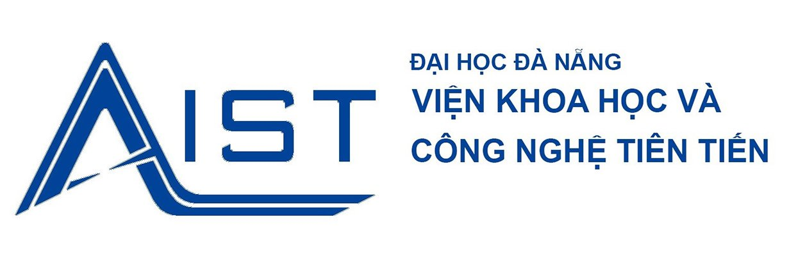

<p align="center">
 
</p>

  <p align="center">A progressive <a href="http://nodejs.org" target="_blank">Node.js</a> framework for building efficient and scalable server-side applications.</p>
    <p align="center">

## Description

[Nest](https://github.com/nestjs/nest) framework TypeScript provide apis services for **Doc-sys**.

## Folder Structure

```
📦project
│   📃 README.md //Start here
|   📁 dist //Compiled files
|   📂 prisma
|   |  📁 migrations //Database migrations
|   |  📃 schema.prisma //Database schema
|   📂 src //Source code
|   |   📁 common //Common files, such as decorators, filters, guards, interceptors, pipes, constants, etc.
|   |   |  📁 decorators //Decorators
|   |   |  📁 filters //Filters
|   |   |  📁 guards //Guards
|   |   |  📁 interceptors //Interceptors
|   |   |  📁 pipes //Pipes
|   |   |  📁 constants //Constants
|   |   |  📁 middlewares //Middlewares
|   |   |  📃 index.ts //Export all common files
|   |   📁 config //Config files
|   |   📁 utils //Utils files, such as logger, converter, etc.

```

## Getting started

1. Requirements
    - [Node.js](https://nodejs.org/en/)
    - [Yarn](https://yarnpkg.com/lang/en/docs/install/#mac-stable)
    <!-- - [Docker](https://www.docker.com/products/docker-desktop) -->
    <!-- - [Docker-compose](https://docs.docker.com/compose/install/) -->
2. Clone the repository

   ```bash
   git clone "https://github.com/blackmouse572/doc_sys_be.git"
   ```

3. Install dependencies

    ```bash
    yarn
    ```

## Running the app

```bash
# development
$ npm run start

# watch mode
$ npm run start:dev

# production mode
$ npm run start:prod
```

## Test

```bash
# unit tests
$ npm run test

# e2e tests
$ npm run test:e2e

# test coverage
$ npm run test:cov
```

## Support

Nest is an MIT-licensed open source project. It can grow thanks to the sponsors and support by the amazing backers. If you'd like to join them, please [read more here](https://docs.nestjs.com/support).

## Stay in touch

- Author - [Kamil Myśliwiec](https://kamilmysliwiec.com)
- Website - [https://nestjs.com](https://nestjs.com/)
- Twitter - [@nestframework](https://twitter.com/nestframework)

## License

Nest is [MIT licensed](LICENSE).
